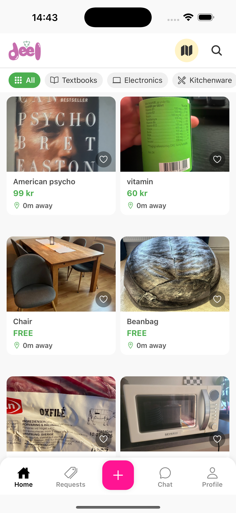

# Deel — A Campus Swap & Trading App

A **hyperlocal marketplace** built for **Gothenburg students** to easily buy, sell, and **swap** items on campus. The core idea is to **reduce friction** and encourage **trust** for real-time trades—be it textbooks, furniture, or electronics.



> **Note:** This project is a **work in progress**. The core features are functional, but additional development is ongoing.

---

## Key Features

1. **Simple Listings**  
   - Students can list items with images, titles, descriptions, and optional tags (like “Textbooks” or “Electronics”).
   - Designed for quick posting and browsing, tailored to campus needs.

2. **Chat-Based Negotiation**  
   - Real-time messaging system (Socket.io) for proposing swaps, discussing details, and finalizing agreements.

3. **QR-Code Verification**  
   - A **QR code** workflow for in-person meetups, ensuring secure and **hassle-free** item exchanges.

4. **Campus Focus**  
   - Ideal for **Gothenburg University** students but can be adapted for any local community or campus environment.

---

## Tech Stack

- **Front End**: [React Native (Expo)](https://expo.dev/)  
- **Back End**: [Node.js](https://nodejs.org/) + [Express.js](https://expressjs.com/)  
- **Database**: [PostgreSQL](https://www.postgresql.org/) + [Prisma](https://www.prisma.io/)  
- **Real-Time Chat**: [Socket.io](https://socket.io/)  
- **Authentication**: [Clerk](https://clerk.dev/)  
- **QR Generation**: [react-native-qrcode-svg](https://github.com/awesomejerry/react-native-qrcode-svg)

---

## Getting Started

1. **Clone the Repo**
   ```bash
   git clone https://github.com/YourUsername/Deel.git
   cd Deel
